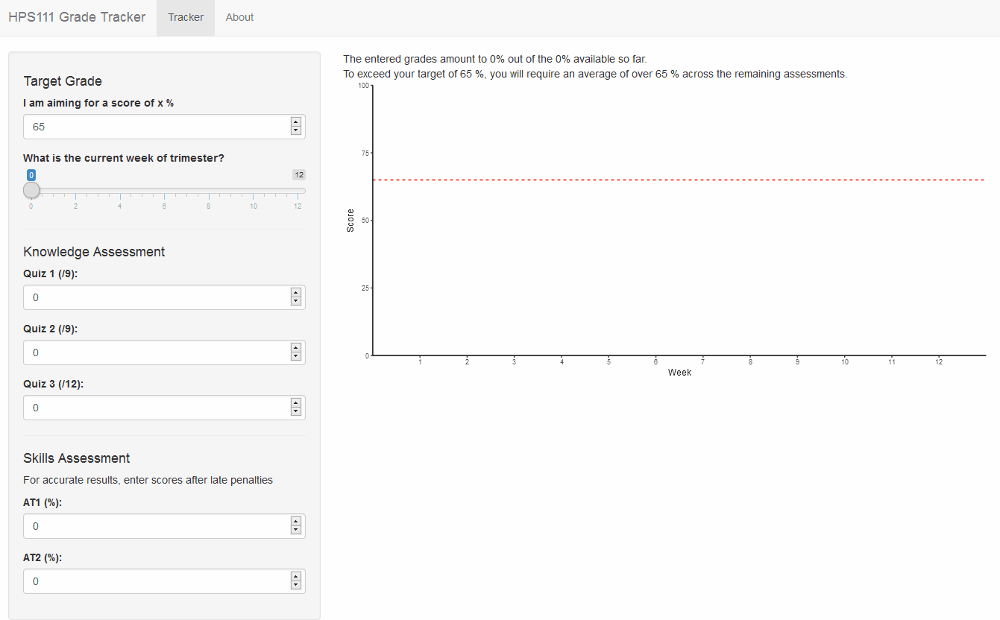

GradeTracker
============

The Gradtracker is a shiny app which enables students in HPS111 at Deakin university to evaluate their progress and estimate their required performance to achieve a self-specified grade target.

While some students are able to do this independently, by providing a shiny app, we enable all students to self benchmark accurately without requiring high staff burden.

The interface is demonstrated below:

If this is useful to you in your own teaching, please fork at will and give me a shout-out.
